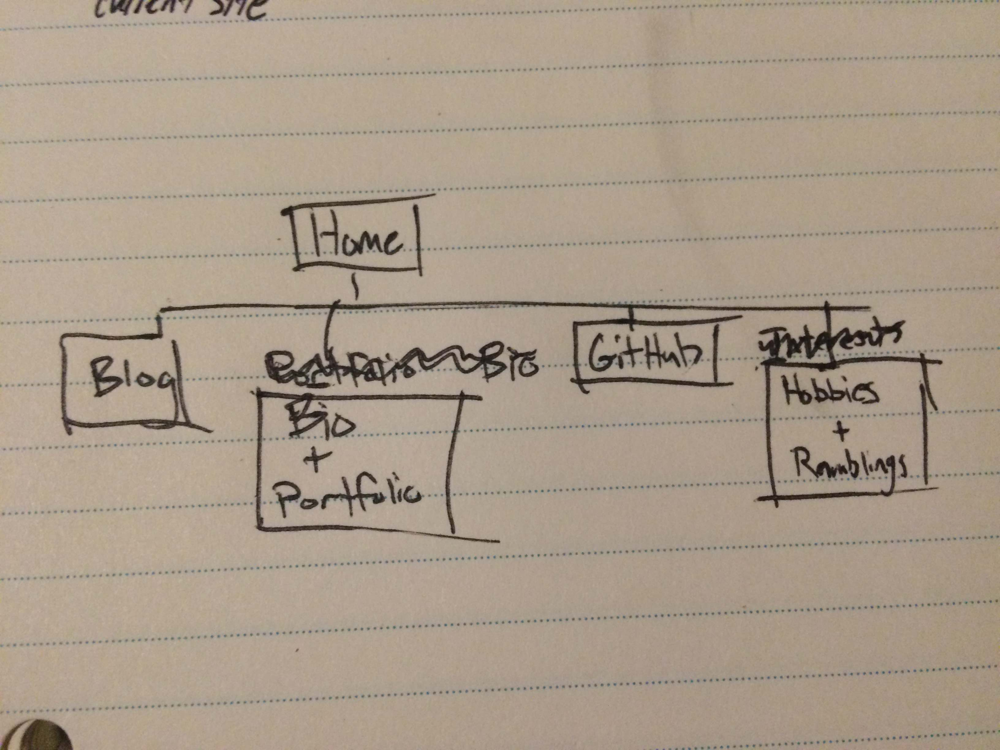

*What are the 6 Phases of Web Design?*
1.Info Gathering
2. Planning
3. Design
4. Development
5. Testing and Delivery
6. Maintenance
*What is your site's primary goal or purpose? What kind of content will your site feature?*

- Let people get to know me over the internet, whether they want to discuss, network, learn, or merely be entertained
- A place for personal reflection and tracking of my own goals
- A place for friends and family to know what I am up to

I am having some difficulty deciding what my site will feature. I have interests in posting about piano, rap analysis, chess, coding, and random musings (or shower thoughts). But how professional do I want my site to be and how many external blogs do I want, or will I even have the time to post all of these? I am not completely sure what the functionality of this site will be. I would like to discuss with others.

*What is your target audience's interests and how do you see your site addressing them?*

Regardless of what side projects fly, the target audience will be future employers or people to network. Perhaps I will market to chess players, rap listeners, aspiring piano players etc., but for now, I will not target those audiences.

One of the goals of my site is to have transparency. Whether it is easily accessible portfolios, or to retain my sense of humor, I want my work and my character to be visible to any visitor. I think the lay-out and writing in the home page will be the most important.

*What is the primary "action" the user should take when coming to your site? Do you want them to search for information, contact you, or see your portfolio? It's ok to have several actions at once, or different actions for different kinds of visitors.*

I want them to be able to find general information about me easily, and have a portfolio and a more detailed bio at a click of a button. Those more interested in my hobbies should be able to find that area of the site at the click of a button. It would be awesome if the front page displayed recently posted material.

*What are the main things someone should know about design and user experience?*

- Design is about solving problems. You can look to others for inspiration, but recognize you are not seeing the problems they are trying to solve, only their solutions.
- User experience is perhaps the most important thing to consider about your site
- Although both design and UX are subjective, this does not mean they are not measureable or that there is no science behind them. There are plenty of resources you can use to guide your own design.
- UX is difficult to measure, but not impossible. Consider A/B testing. Consider surveys. Look for help on the web.

*What is user experience design and why is it valuable?*

User experience design is important because it is design that is focused on your target audience. Your target audience is always users, so you want to make sure they have the most enjoyable/memorable/interesting/easy experience.

*Which parts of the challenge did you find tedious?*

I didn't find any part of this challenge tedious, just a little intimidating. I like the idea of creating my own website, but my own ambitions scare me. It looks like a lot of work.

Just kidding! I found adding the image tedious. Having trouble getting it to work, and the only way I can seem to check is by continuously uploading to GitHub.
