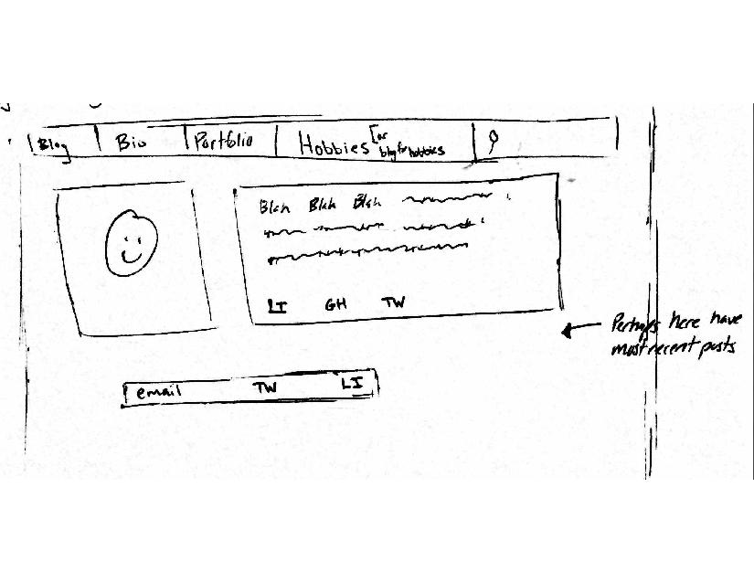
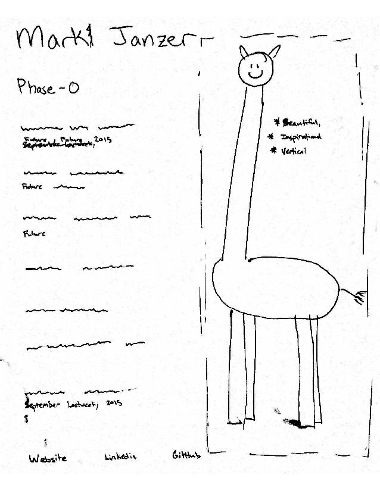

*What is a wireframe?*

A wireframe is a sketch of a website or an application. They are black and white (and some grey) and only frames are drawn, no content. It is meant to show a website's layout and functionality.

*What are the benefits of wireframing?*

Wireframing is a method of sketching that focuses on the fundamental aspects of a site. It helps the creator not get bogged down in details of content or complexities of color while establishing the backbone structure of a site.

*Did you enjoy wireframing your site?*

Yes and no. In some ways I felt that my wireframe was too simple and unoriginal. However, I don't think that they are bad layouts just because they have been used a lot. I also made sure not to spend too much time creating the wireframe. It is very easy for me to get carried away in creative or perfectionistic tendencies when I am doing this type of work.

*Did you revise your wireframe or stick with your first idea?*

I slightly revised my website index's wireframe, but my blog index's wireframe was not revised much at all.

*What questions did you ask during this challenge? What resources did you find to help you answer them?*

I did not Google any questions in this challenge. I looked at using Mockingbird, but I found it easier and more enjoyable to wireframe by hand. Perhaps I should be more inquisitive.

*Which parts of the challenge did you enjoy and which parts did you find tedious?*

I enjoyed drawing out the wireframe. I think I might want to spend more time brainstorming different possible structures, but I don't want to invest large amounts of time until I have completed all of the other challenges.

I uploaded the pictures as PDFs only to find that MarkDown can't do PDFs as inline images, so I converted them to jpg and switched them out. That was a little bit tedious.