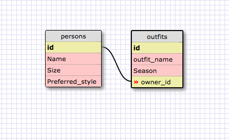

1.
SELECT * FROM states;

2.
SELECT * FROM regions;

3.
SELECT state_name, population FROM states;

4.
SELECT state_name, population FROM states
ORDER BY population DESC;

5.
SELECT state_name FROM states
WHERE region_id = 7;

6.
SELECT state_name, population_density FROM states
WHERE population_density > 50
ORDER BY population_density ASC;

7.
SELECT state_name FROM states
WHERE population BETWEEN 1000000 AND 1500000;

8.
SELECT state_name, region_id FROM states
ORDER BY region_id ASC;

9.
SELECT region_name FROM regions
WHERE region_name LIKE "%central%";

10.
SELECT region_name, state_name FROM states
JOIN regions ON regions.id = region_id
ORDER BY regions.id ASC;

**Reflection**

**What are databases for?**
Databases are for storing information in tables. There are languages like SQL that are designed to access and manage this information. They can hold information premenently, so the information doesn't reset every time you run the JavaScript.

**What is a one-to-many relationship?**
A one to many relationship exists between two different types of objects. There are several (or many) small objects that can all be related to one larger object. Those small objects cannot be related to multiple larger objects, only one.

**What is a primary key? What is a foreign key? How can you determine which is which?**
A primary key is a column that has a unique value for every row. Each instance of the table (or each row) has a unique value for the primary key column. If there is no value explicitly given, SQL will assign the instance a value.

A foreign key is a column or attribute equates to the primary key of another table. These are not necessarily unique for each instance, nor are they automatically assigned. These are used to connect and join tables rather than to be a difinitive key for the table.

**How can you select information out of a SQL database? What are some general guidelines for that?**
You can use the SELECT keyword, followed by the values you want displayed (and they will be displayed in the order that you state). After this you say FROM followed by the table name, indicating where you got the table name from.